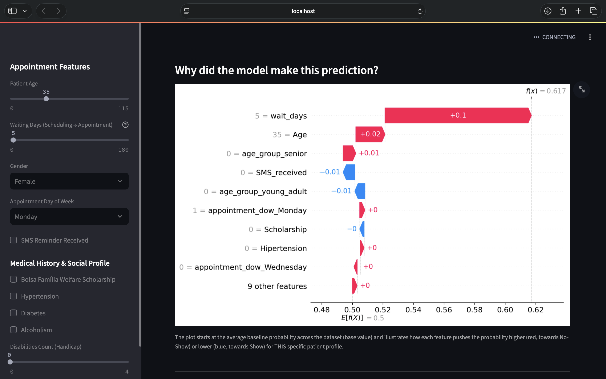

# Medical Appointment No-Show Predictor (Explainable AI)

An end-to-end Machine Learning web solution that predicts patient appointment no-shows and decodes individual predictions using **SHAP values**. 

**Live Demo:** [https://ml-portfolio-4n7fdljepmyha556zwntpx.streamlit.app/](https://ml-portfolio-4n7fdljepmyha556zwntpx.streamlit.app/)

---

##  Model Performance & Evaluation

Evaluated on a held-out test set (20% of historical dataset):

* **ROC-AUC Score:** `0.72`
* **No-Show Recall:** `0.84` *(Optimized to correctly catch actual no-shows and minimize missed interventions)*
* **Overall Accuracy:** `0.79`

> *Note: In healthcare operations, optimizing for **Recall** is crucial because missing a high-risk patient costs significantly more than sending an extra reminder.*

---

##  The Key Insight: The SMS Reminder Paradox

A standard feature importance plot only showed *that* waiting days and SMS reminders mattered. However, SHAP analysis revealed a counter-intuitive operational finding:

* **The Confounding Variable:** Patients who received an SMS had a higher raw no-show rate (27.6%) than those who didn't (16.7%). SHAP dependence plots proved this wasn't causal—SMS reminders were primarily sent for appointments booked far in advance (median wait = 14 days), whereas same-day appointments (wait = 0) received no SMS.
* **Non-Linear Lead Time:** Risk climbs sharply over the first 10–15 days of waiting and then plateaus. Interventions are most effective within this two-week window.

---

## Dashboard Overview

---

##  Key Features

* **Real-Time Risk Calculation:** Predicts individual patient non-attendance risk upon input.
* **Granular Explainability:** Local SHAP waterfall plots explaining the specific drivers behind every prediction.
* **Operational Insights:** Automated risk tagging to help clinic staff prioritize follow-up calls.

---

## Tech Stack & Requirements

* **Python 3.12**
* **Streamlit** (Interactive Web Dashboard)
* **Scikit-Learn** (Random Forest Classifier)
* **SHAP** (Model Interpretability)
* **Pandas / NumPy** (Data Manipulation & Feature Engineering)

---

##  How to Run Locally

1. Clone the repository:
\`\`\`bash
git clone https://github.com/iwannarigds-png/ml-portfolio.git
cd ml-portfolio
\`\`\`

2. Install required dependencies:
\`\`\`bash
pip install -r requirements.txt
\`\`\`

3. Launch the Streamlit dashboard:
\`\`\`bash
streamlit run dashboard_eng.py
\`\`\`

---

## Author & Connect

* **Author:** Iwanna Rig
* **GitHub:** [@iwannarigds-png](https://github.com/iwannarigds-png)
* **Medium:** *(https://medium.com/@iwannarig.ds/beyond-accuracy-uncovering-the-sms-paradox-in-healthcare-no-shows-with-explainable-ai-340d87ad8b66)*

---

##  License

Distributed under the MIT License.